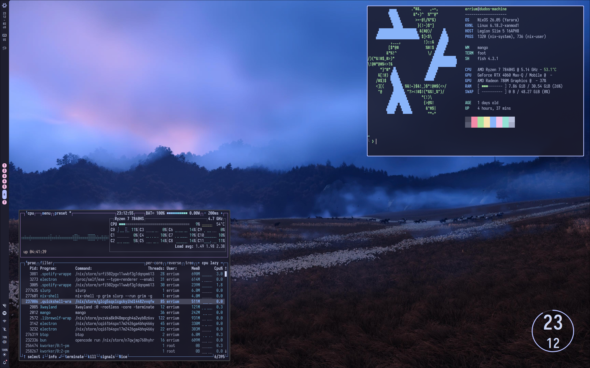

<div align="center">

# ~/nixorcism




_My personal NixOS configuration._

</div>

## 🔧 What's the state?

It was, is, and always will be **WIP**. I tinker with my configs, explore the Nix ecosystem, and stay open-minded to all kinds of software. For those reasons, I'll modify this config as frequently as I want... Like, I could literally drop home-manager tomorrow.

## 💡 What are the goals?

- **Multi-host support** - Single config for multiple machines
- **Unattended installation** - Run the install script inside NixOS .iso and wait for a few minutes
- **Easy experimentation** - Swap desktops, bootloaders, and tools effortlessly
- **Clear architecture** - Self-contained, readable module organization
- **Handy tools** - A bit of CLI awesomeness

## 🗂 How is it structured?

```sh
nixorcism
├── flake.nix
├── flake.lock
├── install.sh
├── README.md
├── assets/
│
├── hosts/
│   ├── dudos-machine/
│   │   ├── configuration.nix
│   │   ├── disko.nix
│   │   └── hardware-configuration.nix
│   └── virtual-nix/
│
└── modules/
    ├── core/
    ├── default.nix
    ├── desktop/
    ├── misc/
    ├── packages/
    ├── services/
    └── shell/
```

- `flake.nix` is the entry point
- `install.sh` handles automated OS installation
- `hosts/` contains machine-specific configurations
- `assets/` has a pic for this README... and that's about it
- `modules/` contains the actual modules! Most are disabled by default and can be enabled with `nixorcism` options
- `modules/core/` contains essentials. You literally can't boot without them. _(Almost)_-all of them are always enabled

## 📠 What tools do I use?

There are _waaay_ too many things I use, and I keep switching, so listing them all would be pointless.

To write this config (& many other cool things) I use **helix** as my editor, with **nixd** as my LSP and **alejandra** as my formatter.

I use **fish** as my primary shell and keep **bash** as a fallback. For shell QoL I have: **zoxide** to jump around directories; **nh** for a _slightly_ better Nix experience; **nix-search-tv** to find more bloatware to install; and **opencode** for occasional vibecoding 😼 _(jk)_.

I have a lot more tools, but I'm not listing them - I might swap something tomorrow and forget to update this README. If you _really_ want to know what I use, check `modules/` and `hosts/dudos-machine/configuration.nix` _(my main machine)_.

## 💬 "Man, I really like your config. Should I run it on my hardware?"

**Lmao, nah.** This is mainly for reference and was never intended (and never will be) for public usage. After all, this repo isn't named "Omarchy: The Sequel." 🤷‍♂️

---

> **P.S.** I made this README because other cool people do. It won't have much useful info and probably will never be updated.  
> Please don't actually use this configuration - it's probably ass. If you find a bug, anti-pattern, or anything of that kind, feel free to laugh and cyberbully me for it.
